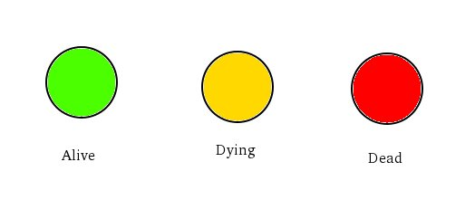
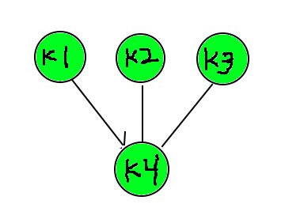

# Killable (WIP) 

> A package for graceful shutdowns in Go

**Note:** The API is still in flux.

A `Killable` represents a group of goroutines. It goes through 3 stages:



0. Alive - The goroutines are running
0. Dying - The goroutines are being signaled to terminate
0. Dead  - All goroutines have terminated

There are two ways a `Killable` can enter the dying state.

0. One of the goroutines returns an `error`
0. The `Kill(error)` method is invoked on the `Killable`

Goroutines managed by the `Killable` can be started with:

* `killable.Go` which starts a goroutine.
* `killable.Do` which blocks while executing.

``` go
k := killable.New()

go func() {
  err := k.Err()
  fmt.Println("Dying because: ", err)
}()

killable.Defer(k, func() {
  fmt.Println("Dead")
})

killable.Go(func() error {
  time.Sleep(5 * time.Second)
  fmt.Println("Finished sleeping, i'll be dead soon")
  return nil
})

k.Kill(fmt.Errorf("it's time to die!"))
```

`Defer` is similar to the `defer` keyword. 

``` go
func Connect(k killable.Killable) (*sql.DB, error) {

  db, err := sql.Open("foo", "bar")
  if err != nil {
    return nil, err
  }

  // clean up resources near instantiation
  // execute in opposite order after Killable is dead
  killable.Defer(k, func() {
    db.Close()
  })

  return db, nil
}
```

`Killable`s can be linked to eachother in a parent/child relationship.

* If a child is killed, the parent is also killed.
* If the parent is killed, it kills all the children.
* If the `reason` is `ErrKillLocal`, the error doesn't propogate.
* The parent doesn't die until all the children are dead

``` go

func makeChild(d time.Duration) killable.Killable {
  k := killable.New()

  killable.Go(k, func() {
    time.Sleep(d)
    return killable.ErrKill
  })

  return k
}

var (
  // children
  k1 = makeChild(2 * time.Second)
  k2 = makeChild(3 * time.Second)
  k3 = makeChild(4 * time.Second)

  // parent
  k4 = killable.New(k1, k2, k3)
)

killable.Defer(k4, func() {
  fmt.Println("All children are dead!")
})

go func() {
  <-k.Dying()
  fmt.Println("Killing all children")
}()

```



See `examples/` directory.

The methods like `Defer`, `Go`, `Do`, etc ...  have been placed in the packages because the `Killable` type is meant to be embedded. The interface the `Killable` type exposes makes sense without understanding the `killable` package.

